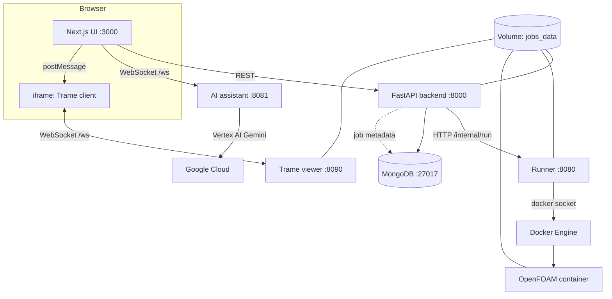

# OpenFOAM Web (Next.js + FastAPI + Docker runner + VTK viewer + AI assistant)

This project is a web application for **submitting and running OpenFOAM cases** from a browser, with an embedded **3D VTK viewer** for results under `case/VTK/`, and an optional **AI assistant** backed by **Google Vertex AI (Gemini)**.

It is split into these main pieces:

- **Frontend** (`frontend/`): Next.js (React) UI for uploading a case ZIP, starting a job, viewing status/logs, downloading results, **controlling the VTK viewer** on the job visualize page, and a floating **AI chat** that talks to the AI service over WebSockets.
- **Backend API** (`backend/`): FastAPI REST API that stores job metadata in **MongoDB**, unpacks the uploaded case, and delegates execution to the runner.
- **Runner** (`openfoam-runner/`): FastAPI internal service that starts a short-lived **OpenFOAM Docker container** (e.g. `opencfd/openfoam-run`) to execute the job and capture logs/results.
- **Trame viewer** (`trame-viewer/`): Python **Trame** app (VTK + wslink) that reads the same job workspace from disk and streams scene data to the browser over **WebSockets**; the UI embeds it in an **iframe** and drives it with **postMessage**.
- **AI assistant** (`ai/`): FastAPI service exposing **`GET /health`** and a **WebSocket `/ws`** chat endpoint. It uses **Vertex AI** with a **Gemini** model; the system prompt is built in `prompt.py` from the current page (run vs job), simulation input fields, and viewer state so the model can suggest parameter changes and viewer commands as structured XML the frontend parses.
- **MongoDB** (`mongo`): persistence for jobs and related metadata (see `docker-compose.yml`).

**AWS dev:** Terraform + a single EC2 host (Docker Compose + ECR) and a **GitHub Actions** workflow on branch `develop` are described in [`deploy/aws/README.md`](deploy/aws/README.md). There is no production deploy in this repo.

The OpenFOAM container workflow matches the usual approach described in OpenFOAM docs (source environment, run commands in the case directory): `https://gitlab.com/openfoam/core/openfoam/-/blob/master/doc/Build.md`

---

## Architecture

### Services and storage



**Ports (default Compose):**

| Service        | Port (host) | Role |
|----------------|-------------|------|
| Frontend       | 3000        | Next.js app |
| Backend        | 8000        | REST API + `/docs` |
| AI assistant   | 8081        | FastAPI + WebSocket chat → Vertex AI Gemini |
| Trame viewer   | 8090        | VTK / Trame + wslink |
| MongoDB        | 127.0.0.1:27017 | Database (optional local access) |
| Runner         | internal    | Not published; backend calls it |

All job files (unpacked case, logs, VTK output) live on the shared **`jobs_data`** volume so the backend, runner, OpenFOAM job container, and Trame viewer see the **same** `/jobs/<job_id>/` tree.

### Data flow (one job: run → visualize)

1. You upload a **case ZIP** in the UI.
2. Backend creates a job in MongoDB and extracts the ZIP to **`/jobs/<job_id>/case/`** on `jobs_data`.
3. Backend calls the runner: `POST http://openfoam-runner:8080/internal/run`.
4. Runner starts an OpenFOAM container with **`jobs_data`** mounted and runs your command(s) in the case directory (e.g. `foamToVTK` to produce **`case/VTK/`**).
5. Runner writes combined stdout/stderr to **`/jobs/<job_id>/openfoam.log`** (on the same volume).
6. Backend serves job status, logs, outputs listing, and ZIP download.
7. On the **Visualize job** page, the frontend loads an iframe pointing at the Trame viewer (see `NEXT_PUBLIC_TRAME_VIEWER_URL`). Trame reads **`/jobs/<job_id>/case/VTK/`** from disk (same volume), builds a VTK scene server-side, and syncs geometry/state to the browser via **wslink** (`VtkLocalView`: rendering in the browser, serialization on the server).

### AI assistant flow (chat → model → UI actions)

1. The user opens the floating **AI Assistant** on either the **Run simulation** page (`pageContext: "run"`) or the **Job visualization** page (`pageContext: "job"`).
2. The frontend (`frontend/app/components/ChatBot.tsx`) opens a WebSocket to the AI service URL from **`NEXT_PUBLIC_AI_WS_URL`** (Compose defaults to `ws://localhost:8081/ws`; if unset, the client falls back to `ws://<hostname>:8081/ws`).
3. On connect, the client sends **`init`** with `pageContext`, and optionally `inputFields` (simulation template fields) and/or `viewerState` (times, files, scalars, regions, etc.). The server constructs a **`ChatSession`**: it initializes **Vertex AI** for `GOOGLE_CLOUD_PROJECT_ID` (region `us-central1`), builds the system prompt via **`create_system_prompt()`** in `ai/prompt.py`, and seeds the Gemini chat with that prompt.
4. User messages are sent as **`user_message`**. The model replies with plain text plus optional **XML fragments** documented in `prompt.py`. The client parses them in **`frontend/lib/aiChat.ts`** (`parseAssistantXml`):
   - **`<UpdateInputs>{…}</UpdateInputs>`** — JSON object mapping field keys to string values; applied on the run page through **`onUpdateInputs`**.
   - **`<ViewerCmd>{…}</ViewerCmd>`** — JSON with an `action` (e.g. `set_time`, `next_time`, `set_scalar`, `play`, `toggle_streamlines`); applied on the job page through **`onViewerCmd`** (same bridge as manual controls).
   - **`<NeedMoreInfo>…</NeedMoreInfo>`** / **`<CasualMessage>…</CasualMessage>`** — shown as conversational text when there is no other display text.
5. The server also supports **`update_context`** to rebuild the session with new `inputFields` / `viewerState` without reconnecting (see `ai/server.py`); the live UI may reconnect on panel open rather than streaming every viewer tick.

**Credentials and configuration (AI container):**

- **`GOOGLE_CLOUD_PROJECT_ID`**: required; the service calls `vertexai.init(project=..., location="us-central1")`.
- **`GOOGLE_APPLICATION_CREDENTIALS`**: path to a service account JSON with Vertex AI / Gemini access. Compose mounts **`./ai/credentials/key.json`** read-only at `/app/credentials/key.json` and sets this env var.
- **`GEMINI_MODEL`**: optional; default in code is `gemini-2.5-flash`.

**Health check:** `GET http://localhost:8081/health` returns `{"status":"ok","model":...}`.

### How the job page talks to the viewer (without duplicating Trame UI)

The iframe is intentionally **VTK-only** (no full Trame chrome). Control lives on the **parent** Next.js page:

1. **Parent → iframe:** `window.postMessage` with types such as `openfoam-trame-set-job`, `openfoam-trame-patch-state` (time, file, region, scalar, play, streamlines), and `openfoam-trame-cmd` (prev/next/load/refresh/toggle play). Implemented in `frontend/lib/trameBridge.ts` and the job page.
2. **iframe → parent:** the Trame app loads **`/openfoam-fullbleed.js`** and **`/openfoam-bridge.js`** (served by the viewer, not embedded as `<script>` inside the Vue template) which mirror state into hidden fields and post **`openfoam-trame-state`** messages so React can show status and fill dropdowns.

Relevant env vars (see `docker-compose.yml`):

- **`NEXT_PUBLIC_TRAME_VIEWER_URL`**: browser-visible Trame origin (e.g. `http://localhost:8090`). Required for **standalone** Next builds so the iframe does not rely on same-origin rewrites. When set, the iframe also gets a **`sessionURL`** query (`ws://…/ws` to that host) so the Trame client connects straight to wslink (reliable after refresh). It is omitted when this env is unset so `next dev` + `/viewer` proxy does not send the WebSocket to port 3000 by mistake.
- **`NEXT_PUBLIC_AI_WS_URL`**: browser-reachable WebSocket URL for the AI service (e.g. `ws://localhost:8081/ws`). Passed as a **build arg** to the frontend image so the client knows where to connect in production.
- **`JOBS_ROOT`**: path inside Trame (and other) containers where `jobs_data` is mounted (default `/jobs`).
- **`TRAME_WS_MAX_MSG_SIZE`**: raises the WebSocket frame limit for large VTK payloads.

---

## Run (Docker Compose)

Prerequisites:

- Docker Desktop (or Docker Engine) running

Start everything:

```bash
cd /Users/farhad/Desktop/OpenFOAM
docker compose up --build
```

Endpoints:

- **UI**: `http://localhost:3000`
- **Backend**: `http://localhost:8000`
- **Backend docs**: `http://localhost:8000/docs`
- **Trame VTK viewer** (direct): `http://localhost:8090` (normally embedded from the job visualize page)

Stop:

```bash
docker compose down
```

Reset all data (jobs + database):

```bash
docker compose down -v
```

---

## Case upload format (ZIP)

Upload a **`.zip`** whose contents are an OpenFOAM case directory.

The backend extracts your ZIP into `/jobs/<job_id>/case/` and the runner executes your commands from that directory.

### Recommended ZIP layout (top-level contains the case)

Your ZIP should have these at its top-level:

- `system/` (e.g. `controlDict`, `fvSchemes`, `fvSolution`)
- `constant/` (e.g. `physicalProperties`, `transportProperties`, mesh dicts or triSurface)
- a time directory such as `0/` or `0.orig/`

Example:

- `system/controlDict`
- `system/fvSchemes`
- `system/fvSolution`
- `constant/physicalProperties`
- `0/U`
- `0/p`

This works with the default commands:

- `blockMesh && simpleFoam`

### If the ZIP contains a single root folder

If the ZIP contains e.g. `myCase/system/...` (one folder at the top), then set commands like:

- `cd myCase && blockMesh && simpleFoam`

---

## Commands you can run

The “commands” field is executed via:

- `bash -lc "<commands>"`

inside an OpenFOAM container **after** `source <etc/bashrc>`.

Examples:

- Basic: `blockMesh && simpleFoam`
- Run a provided script: `bash run`
- Parallel (example): `decomposePar && mpirun -np 4 simpleFoam -parallel && reconstructPar`

---

## Common troubleshooting

### “Mounts denied … path … is not shared” (macOS)

This project avoids host bind-mounting job paths into OpenFOAM containers by using a **named Docker volume**. If you see this error again, it usually means something is still trying to mount a host path. Restart with:

```bash
docker compose down
docker compose up --build
```

### Job fails immediately / log is empty

Most often:

- the ZIP unpacks into a nested folder, but your commands assume `system/` is at the root
- the case requires a different meshing/solver sequence (e.g. `snappyHexMesh`, `extrudeMesh`, `rhoPimpleFoam`, etc.)

Open the job log in the UI (“Log”) and adjust the commands accordingly.

### VTK viewer blank or iframe “disconnects”

- Ensure the job has **`case/VTK/`** (e.g. run **`foamToVTK`** in the job commands).
- **`NEXT_PUBLIC_TRAME_VIEWER_URL`** must match where the browser can reach Trame (set at **frontend image build** time in Compose). If it is wrong, the iframe may 404 or point at the wrong host.
- Very large meshes need a high **`TRAME_WS_MAX_MSG_SIZE`** (already raised in Compose for `trame-viewer`).
- Docker logs may show `Cannot write to closing transport` if the tab refreshed or the socket closed while a large payload was still sending; that is a **client disconnect**, not necessarily a crashed viewer container. Check with `docker compose ps` and `docker logs openfoam-trame-viewer-1`.

### AI assistant: “Cannot reach AI service” or errors on first message

- Confirm the **`ai`** container is up (`docker compose ps`) and **`http://localhost:8081/health`** responds.
- **`GOOGLE_CLOUD_PROJECT_ID`** must be set to a project that has **Vertex AI** enabled; override via shell env or `.env` next to Compose if you do not use the default in `docker-compose.yml`.
- The mounted **`ai/credentials/key.json`** must be a valid service account key for that project with permission to call the Generative AI / Vertex API.
- If the browser runs on another machine, **`NEXT_PUBLIC_AI_WS_URL`** must use a host the **browser** can reach (not only `localhost` on the server).

---

## Project layout

- `docker-compose.yml`: all services, `jobs_data` + `mongo_data` volumes, env wiring for API, Trame, CORS, and AI credentials mount
- `frontend/`: Next.js UI (`app/jobs/[jobId]/page.tsx` embeds the viewer and viewer controls; `app/components/ChatBot.tsx` + `lib/aiChat.ts` implement the AI client)
- `backend/`: FastAPI public API (jobs, logs, download, outputs)
- `openfoam-runner/`: internal runner that launches OpenFOAM containers
- `trame-viewer/`: Trame + VTK viewer (`app.py`), Dockerfile installs headless OpenGL support for server-side VTK serialization
- `ai/`: OpenFOAM-focused Gemini chat — `server.py` (FastAPI + WebSocket), `prompt.py` (system prompt and XML tag contract), `Dockerfile` (uvicorn on port **8081**), `requirements.txt`; place a service account JSON at **`credentials/key.json`** (or adjust the Compose mount) and treat it like any other secret

