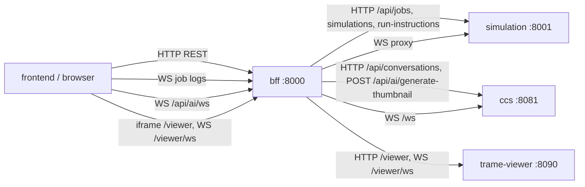

# BFF (Backend-for-Frontend)

Public HTTP/WebSocket gateway for the Next.js UI. Proxies job and simulation REST to **simulation**, conversation/AI traffic to **CCS**, and the VTK Trame app to **trame-viewer**, exposing a single browser origin (`localhost:8000`) with CORS configured for the frontend.

| | |
|---|---|
| **Compose service** | `bff` |
| **Port** | `8000` (published to host) |
| **Module** | `services.bff.app:app` |

## Environment variables

| Variable | Default | Description |
|----------|---------|-------------|
| `SIMULATION_SERVICE_URL` | `http://simulation:8001` | Upstream simulation base URL |
| `CCS_SERVICE_URL` | `http://ccs:8081` | Upstream Chat Conversation Service base URL |
| `TRAME_VIEWER_URL` | `http://trame-viewer:8090` | Upstream Trame VTK viewer base URL |
| `CORS_ORIGINS` | `http://localhost:3000,http://127.0.0.1:3000` | Allowed browser origins (comma-separated) |

## Interfaces with other services



| Direction | Peer | Protocol | Purpose |
|-----------|------|----------|---------|
| In | frontend (browser) | HTTP, WebSocket | Public API on port 8000 |
| Out | simulation | HTTP, WebSocket | Jobs, simulations, run instructions |
| Out | ccs | HTTP, WebSocket | Conversations CRUD, AI chat, thumbnails |
| Out | trame-viewer | HTTP, WebSocket | VTK iframe + wslink (`/viewer` → `/`, `/viewer/ws` → `/ws`) |

## Main routes

| Method | Path | Notes |
|--------|------|--------|
| `GET` | `/health` | BFF status + simulation and CCS downstream health |
| `GET` | `/docs`, `/redoc` | **BFF OpenAPI** (proxy routes only; not simulation/CCS full schemas) |
| `GET` | `/api-docs/` | **Scalar** — one OpenAPI doc per service (`make openapi` to refresh) |
| `*` | `/api/jobs`, `/api/simulations`, `/api/run-instructions` | Proxied to simulation |
| `WS` | `/api/jobs/{job_id}/ws` | Live log tail; proxied to simulation |
| `*` | `/api/conversations`, `/api/conversations/{id}`, `.../messages` | Proxied to CCS (no business logic in BFF) |
| `WS` | `/api/ai/ws` | Proxied to CCS `/ws` |
| `POST` | `/api/ai/generate-thumbnail` | Proxied to CCS `/generate-thumbnail` |
| `POST` | `/api/ai/troubleshoot` | Proxied to CCS `/api/ai/troubleshoot` (job log AI debug) |
| `*` | `/viewer`, `/viewer/{path}` | Proxied to trame-viewer (VTK iframe) |
| `WS` | `/viewer/ws` | Proxied to trame-viewer `/ws` (wslink) |

The BFF does not implement job, conversation, or viewer logic. See [simulation README](../simulation/README.md) and [ccs README](../ccs/README.md).

## Swagger / OpenAPI

BFF Swagger (`http://localhost:8000/docs`) lists **only** routes this gateway handles. Proxy paths are documented as stubs in `openapi.py` (summaries + upstream targets); request/response schemas remain on simulation and CCS.

| Service | How to open docs |
|---------|------------------|
| **BFF** (this service) | `http://localhost:8000/docs` |
| **All services (Scalar)** | `http://localhost:8000/api-docs/` |
| simulation | `docker compose exec simulation curl -s http://localhost:8001/docs` |
| ccs | `http://localhost:8081/docs` (host-published in default Compose) |
| forge-runner | `docker compose exec forge-runner curl -s http://localhost:8080/docs` |
| ics | `docker compose exec ics curl -s http://localhost:8082/docs` |

Rebuild the `bff` image after changing `app.py` or `openapi.py`: `docker compose up -d --build bff`.

## Run locally

From repo root with Compose:

```bash
docker compose up bff
```

Requires **simulation**, **ccs**, and **trame-viewer** reachable on the Compose network.

```bash
cd backend
SIMULATION_SERVICE_URL=http://localhost:8001 \
CCS_SERVICE_URL=http://localhost:8081 \
  uvicorn services.bff.app:app --host 0.0.0.0 --port 8000
```

Health: `curl -s http://localhost:8000/health | jq`
