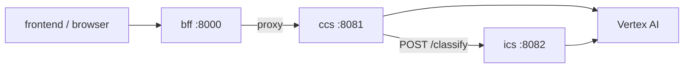

# CCS (Chat Conversation Service)

Owns AI chat **conversations** (REST CRUD + optional message history), WebSocket streaming chat, and simulation card thumbnails. Classifies each user message via **ICS**, routes to one of three **intent-specialized agents**, and uses Vertex AI (Gemini).

| | |
|---|---|
| **Compose service** | `ccs` |
| **Port** | `8081` (published to host) |
| **Module** | `services.ccs.app:app` |

## Environment variables

| Variable | Default | Description |
|----------|---------|-------------|
| `GOOGLE_CLOUD_PROJECT_ID` | (see Compose) | GCP project for Vertex |
| `GOOGLE_APPLICATION_CREDENTIALS` | `/app/credentials/key.json` | Service account JSON (mounted read-only) |
| `GEMINI_MODEL` | `gemini-2.5-flash` | Chat model |
| `GEMINI_IMAGE_MODEL` | `gemini-2.5-flash-image` | Thumbnail generation |
| `VERTEX_LOCATION` | `us-central1` | Vertex region (`shared/vertex.py`) |
| `ICS_URL` | `http://ics:8082` | Intent classification service |

## Storage

Conversation metadata and messages are held **in memory** (`conversations.py`) and are lost when the CCS process restarts. The browser should use the **BFF** (`/api/conversations`) in production paths; direct `:8081` access is for ops and Swagger.

## Interfaces with other services



| Direction | Peer | Protocol | Purpose |
|-----------|------|----------|---------|
| In | bff | HTTP, WebSocket | Proxied public API |
| Out | ics | HTTP | Per-message intent classification |
| Out | Vertex AI | Google GenAI / Vertex | LLM and image generation |

### Intent agents

On WebSocket `init`, CCS creates **three** Gemini sessions (one per ICS intent in `services/ccs/agents/`):

| Intent id | Agent focus |
|-----------|-------------|
| `simulation_execution` | Run/stop, SimAction, job control |
| `parameter_configuration` | UpdateInputs, BCs, template fields |
| `results_analysis` | ViewerCmd, VTK, interpreting results |

Each `user_message` is classified by ICS; CCS selects the matching session so **conversation history is preserved per intent** on the same WebSocket. The `assistant_message` payload includes `agent` and `agent_label` for the UI.

Shared XML rules live in `prompt.py`; intent-specific role text in `agents/*.py`. Parsed in `frontend/lib/aiChat.ts`.

## Main routes

| Method | Path | Description |
|--------|------|-------------|
| `GET` | `/health` | Service status + credential check |
| `GET` | `/docs`, `/redoc` | OpenAPI UI (Swagger) |
| `POST` | `/api/conversations` | Create conversation |
| `GET` | `/api/conversations` | List conversations |
| `GET` | `/api/conversations/{id}` | Get conversation + messages |
| `DELETE` | `/api/conversations/{id}` | Delete conversation |
| `GET` | `/api/conversations/{id}/messages` | Message history only |
| `WS` | `/ws` | Chat: `init`, `user_message`, `update_context` |
| `POST` | `/generate-thumbnail` | PNG thumbnail (also via BFF `/api/ai/generate-thumbnail`) |
| `POST` | `/api/ai/troubleshoot` | One-shot job log troubleshooting (BFF `/api/ai/troubleshoot`; no ICS) |

### Job troubleshooting (REST)

`POST /api/ai/troubleshoot` accepts JSON: `job_id`, `log`, `job` metadata, optional `simulation` template, `inputs_applied`, and `fatal_hints`. CCS uses `agents/troubleshooting.py` and a single Gemini `generate_content` call (not WebSocket, not ICS). Response: `{ "guide": "...", "job_id": "..." }`.

### WebSocket protocol

Browser URL via BFF (local): `ws://localhost:8000/api/ai/ws` (`NEXT_PUBLIC_AI_WS_URL` or derived from `NEXT_PUBLIC_API_URL`).

`init` may include optional `conversationId` to append `user_message` / `assistant_message` turns to that conversation.

`user_message` flow: ICS classify → route to intent session → `assistant_message` with optional `agent`, `agent_label`. Clients still receive `intent_classification` before the reply.

## Swagger

Open **`http://localhost:8081/docs`** when the `ccs` Compose service is running (host port published). For the same REST paths through the gateway, use **`http://localhost:8000/docs`** on the BFF (proxy stubs only).

## Run locally

```bash
docker compose up ccs
```

Requires `backend/credentials/key.json` on the host (not committed) and running **ics**.

```bash
cd backend
GOOGLE_APPLICATION_CREDENTIALS=./credentials/key.json ICS_URL=http://localhost:8082 \
  uvicorn services.ccs.app:app --host 0.0.0.0 --port 8081
```

Health: `curl -s http://localhost:8081/health | jq`
