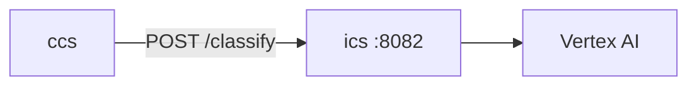

# ICS (Intent Classification Service)

Classifies user chat messages into intents before CCS generates a reply. Uses Vertex AI (Gemini) with a fixed intent catalog in `intents.py`. Internal-only in default Compose—not published to the host.

| | |
|---|---|
| **Compose service** | `ics` |
| **Port** | `8082` (internal `expose` only) |
| **Module** | `services.ics.app:app` |

## Environment variables

| Variable | Default | Description |
|----------|---------|-------------|
| `GOOGLE_CLOUD_PROJECT_ID` | (see Compose) | GCP project for Vertex |
| `GOOGLE_APPLICATION_CREDENTIALS` | `/app/credentials/key.json` | Service account JSON (shared mount with CCS) |
| `GEMINI_MODEL` | `gemini-2.5-flash` | Classification model |
| `VERTEX_LOCATION` | `us-central1` | Vertex region |

## Interfaces with other services



| Direction | Peer | Protocol | Purpose |
|-----------|------|----------|---------|
| In | ccs | HTTP | Intent classification on each user message |
| Out | Vertex AI | Vertex / GenAI | LLM classification |

`primary_intent` from `POST /classify` selects which CCS specialist agent handles the reply (`simulation_execution`, `parameter_configuration`, `results_analysis`). See `backend/services/ccs/README.md`.

## Main routes

| Method | Path | Description |
|--------|------|-------------|
| `GET` | `/health` | Credentials + intent catalog summary |
| `GET` | `/intents` | List intent definitions |
| `POST` | `/classify` | Body: `{ "message", "page_context": "run" \| "job" }` |

## Run locally

```bash
docker compose up ics
```

```bash
cd backend
GOOGLE_APPLICATION_CREDENTIALS=./credentials/key.json \
  uvicorn services.ics.app:app --host 0.0.0.0 --port 8082
```

Health (via exec):

```bash
docker compose exec ccs curl -s http://ics:8082/health
```

## Swagger / OpenAPI

Internal only (port `8082` not published to host in default Compose):

```bash
docker compose exec ics curl -s http://localhost:8082/docs
```
