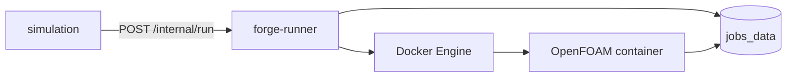

# Runner service

Internal microservice that starts short-lived OpenFOAM solver containers via the Docker socket. Streams container logs to `/jobs/<job_id>/forge.log` on the shared volume so simulation and the UI can tail progress.

| | |
|---|---|
| **Compose service** | `forge-runner` |
| **Port** | `8080` (internal `expose` only; not mapped to host in default Compose) |
| **Module** | `services.runner.app:app` |

## Environment variables

| Variable | Default | Description |
|----------|---------|-------------|
| `JOBS_ROOT` | `/jobs` | Job workspace (must match simulation mount) |
| `OPENFOAM_IMAGE` | `opencfd/openfoam-run:2512` | Solver container image |
| `OPENFOAM_BASHRC` | (image default) | Documented in health response; not sourced in run script |
| `JOBS_VOLUME_NAME` | `forge-jobs-data` | Named volume passed into child containers |
| `JOBS_VOLUME_MOUNT` | `/work` | Mount path inside solver container |

On AWS dev, `JOBS_VOLUME_NAME` must match the volume used by simulation and child solvers (see `deploy/aws/README.md`).

## Interfaces with other services



| Direction | Peer | Protocol | Purpose |
|-----------|------|----------|---------|
| In | simulation | HTTP | Run and optional cleanup |
| Out | Docker Engine | Docker API | Create/run/remove solver containers |
| Shared | simulation, trame-viewer | volume | Case files and logs under `JOBS_ROOT` |

## Main routes

| Method | Path | Caller | Description |
|--------|------|--------|-------------|
| `GET` | `/health` | ops / simulation stack | Docker API reachability + config summary |
| `POST` | `/internal/run` | simulation | Run shell commands in case dir inside solver container |
| `POST` | `/internal/cleanup/{job_id}` | optional | Remove job directory on volume |

## Run locally

```bash
docker compose up forge-runner
```

Requires Docker socket mount (`/var/run/docker.sock`) and `jobs_data` volume.

```bash
cd backend
JOBS_ROOT=/jobs JOBS_VOLUME_NAME=forge-jobs-data \
  uvicorn services.runner.app:app --host 0.0.0.0 --port 8080
```

Health (from another container on the Compose network):

```bash
docker compose exec simulation curl -s http://forge-runner:8080/health
```

## Swagger / OpenAPI

Internal only (port `8080` not published to host in default Compose):

```bash
docker compose exec forge-runner curl -s http://localhost:8080/docs
```

Also: `http://localhost:8080/redoc`, `/openapi.json` inside the container network.
