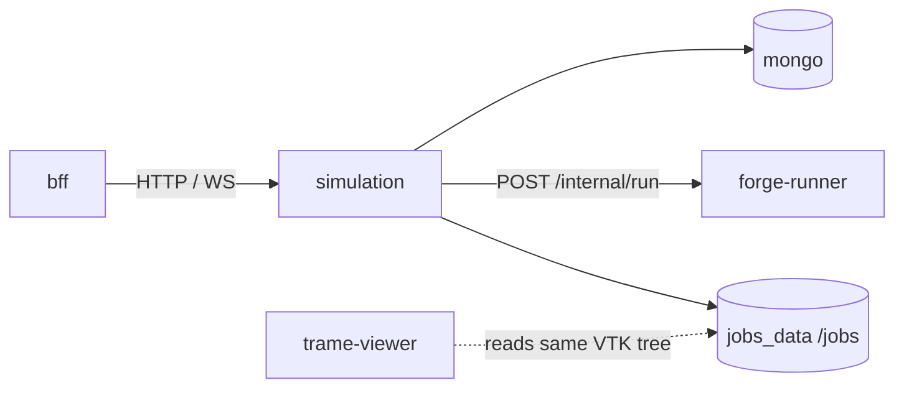

# Simulation service

Owns job and simulation lifecycle: ZIP upload, case extraction on the shared jobs volume, MongoDB metadata, runner orchestration, log tailing, and downloads. Not exposed directly to the browser in Compose—the **bff** proxies all public API access.

| | |
|---|---|
| **Compose service** | `simulation` |
| **Port** | `8001` (internal `expose` only in default Compose) |
| **Module** | `services.simulation.app:app` |

## Environment variables

| Variable | Default | Description |
|----------|---------|-------------|
| `JOBS_ROOT` | `/jobs` | Job workspace root on shared volume |
| `RUNNER_URL` | `http://forge-runner:8080` | Internal runner base URL |
| `MONGODB_URI` | `mongodb://mongo:27017` | MongoDB connection string |
| `MONGODB_DB` | `forge_web` | Database name |

## Interfaces with other services



| Direction | Peer | Protocol | Purpose |
|-----------|------|----------|---------|
| In | bff | HTTP, WebSocket | All `/api/*` (proxied) |
| Out | mongo | MongoDB wire protocol | Jobs, simulations, run instructions |
| Out | forge-runner | HTTP | Start solver containers |
| Shared | trame-viewer, runner | filesystem | `jobs_data` volume at `JOBS_ROOT` |

## Main API routes

Proxied via BFF at `http://localhost:8000` unless calling simulation directly.

| Area | Methods | Paths |
|------|---------|-------|
| Health | `GET` | `/health` |
| Jobs | `GET`, `POST` | `/api/jobs`, `/api/jobs/{id}`, `/api/jobs/{id}/log`, `/api/jobs/{id}/outputs`, `/api/jobs/{id}/result-fields`, `/api/jobs/{id}/download`, `/api/jobs/{id}/case/{path}` |
| Job logs | `WS` | `/api/jobs/{id}/ws` |
| Run instructions | CRUD | `/api/run-instructions`, `/api/run-instructions/{id}` |
| Simulations | CRUD + run | `/api/simulations`, `/api/simulations/{id}`, `/api/simulations/analyze-zip`, `/api/simulations/analyze-result-zip`, `/api/simulations/{id}/run`, `/api/simulations/{id}/thumbnail`, `/api/simulations/{id}/case-analysis`, `/api/simulations/{id}/result-case-analysis` |
| Mass run | preview, start, list, status, CSV, ZIP | `POST /api/simulations/{id}/mass-run/preview`, `POST /api/simulations/{id}/mass-run`, `GET /api/mass-runs`, `GET /api/mass-runs/{id}`, `GET /api/mass-runs/{id}/results.csv`, `GET /api/mass-runs/{id}/download` |
| Predictive model | train/test mass-run split per simulation | `GET /api/simulations/{id}/predictive-model`, `PUT /api/simulations/{id}/predictive-model` |

Runner call (internal, not via BFF): `POST {RUNNER_URL}/internal/run` with `{ "job_id", "commands" }`.

## Run locally

```bash
docker compose up simulation
```

Requires healthy `mongo` and started `forge-runner`.

```bash
cd backend
JOBS_ROOT=/jobs MONGODB_URI=mongodb://localhost:27017 RUNNER_URL=http://localhost:8080 \
  uvicorn services.simulation.app:app --host 0.0.0.0 --port 8001
```

Health (inside Compose network):

```bash
docker compose exec simulation curl -s http://localhost:8001/health
```

## Swagger / OpenAPI

Not exposed on the host in default Compose. From another container on the Compose network:

```bash
docker compose exec simulation curl -s -o /dev/null -w '%{http_code}\n' http://localhost:8001/docs
```

OpenAPI JSON: `http://localhost:8001/openapi.json` (same network). The browser uses **BFF** at `http://localhost:8000/docs` for the public gateway; job/simulation routes are proxied but full simulation schemas are on this service.
