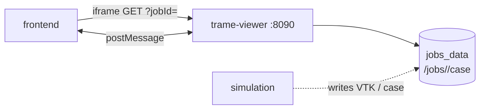

# Trame viewer

VTK visualization for job results using Trame and wslink. Reads case and VTK data from the shared `jobs_data` volume. The Next.js UI embeds it in an iframe and synchronizes state via `postMessage` (`frontend/lib/trameBridge.ts`).

| | |
|---|---|
| **Compose service** | `trame-viewer` |
| **Port** | `8090` (published to host) |
| **Entry** | `python /deploy/app.py` (see service `Dockerfile`) |

Built from a **separate image** (`backend/services/trame-viewer/`), not the shared backend image.

## Environment variables

| Variable | Default | Description |
|----------|---------|-------------|
| `JOBS_ROOT` | `/jobs` | Job workspace (same volume as simulation) |
| `TRAME_WS_MAX_MSG_SIZE` | `134217728` | WebSocket max message size |
| `WSLINK_HEART_BEAT` | `120` | wslink heartbeat interval (seconds) |
| `VIEWER_PLAY_INTERVAL` | `0` | Default delay between animation frames |
| `VIEWER_PLAY_MIN_INTERVAL` | `0.25` | Minimum frame interval (event-loop breathing room) |
| `VIEWER_VTK_DATASET_CACHE` | `24` | LRU cache size for loaded VTK datasets (0 = off) |

## Interfaces with other services



| Direction | Peer | Protocol | Purpose |
|-----------|------|----------|---------|
| In | frontend | HTTP, WebSocket (wslink), postMessage | Embed viewer, drive time/scalar/play |
| Data | jobs volume | filesystem | `case/`, `case/VTK/`, time directories |
| — | simulation / runner | indirect | Produces VTK and case files on the volume |

There is **no** `/health` HTTP route; availability is inferred from the Trame/wslink session on port `8090`.

There is **no** OpenAPI/Swagger surface — the viewer uses Trame, wslink (`/ws`), and the `postMessage` bridge (`frontend/lib/trameBridge.ts`), not REST CRUD.

## Main surface

| Kind | Access | Notes |
|------|--------|--------|
| Trame app | `http://localhost:8090/?jobId=<uuid>` | Primary embed URL (`frontend/lib/trame.ts`) |
| Bridge | `forge-trame-*` postMessage types | Parent ↔ iframe control and state snapshots |
| VTK paths | under `{JOBS_ROOT}/{jobId}/case/` | Auto-discovered times, regions, files |

## Run locally

```bash
docker compose up trame-viewer
```

Requires `jobs_data` volume with an extracted case (create a job via the UI or simulation API first).

Rebuild after viewer changes:

```bash
docker compose build trame-viewer && docker compose up -d trame-viewer
```

Probe (no dedicated health endpoint):

```bash
curl -s -o /dev/null -w "%{http_code}" "http://localhost:8090/?jobId=test"
```
