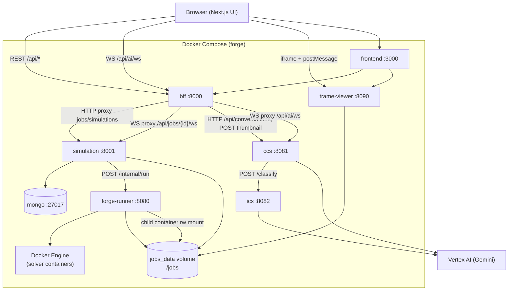

# Service map

Central view of Forge microservices, ports, and call relationships. Per-service detail lives in each service `README.md` under `backend/services/<name>/`.

## Runtime status (local Compose)

| Compose service | Directory | Host port | Health / probe |
|-----------------|-----------|-----------|----------------|
| `mongo` | (image) | `127.0.0.1:27017` | Compose healthcheck (`mongosh` ping) |
| `bff` | `backend/services/bff/` | `8000` | `GET http://localhost:8000/health` |
| `simulation` | `backend/services/simulation/` | internal `8001` | `GET /health` (via BFF downstream or `docker compose exec simulation curl -s localhost:8001/health`) |
| `forge-runner` | `backend/services/runner/` | internal `8080` | `GET /health` (exec into container; not published to host) |
| `ccs` | `backend/services/ccs/` | `8081` | `GET http://localhost:8081/health` |
| `ics` | `backend/services/ics/` | internal `8082` | `GET /health` (exec into container) |
| `trame-viewer` | `backend/services/trame-viewer/` | `8090` | No `/health`; probe `http://localhost:8090/?jobId=<id>` or wslink session |
| `frontend` | `frontend/` | `3000` | HTTP `GET http://localhost:3000/` (no dedicated health route) |

Shared volume: **`forge-jobs-data`** (`jobs_data` in Compose) mounted at `/jobs` in simulation, runner, and trame-viewer.

## Architecture diagram

## Interface table

| Service | Port (Compose) | Callers | Callees | Key endpoints |
|---------|----------------|---------|---------|-----------------|
| **frontend** | `3000` | Browser | BFF (REST + AI WS), trame-viewer (iframe) | Next.js pages; env: `NEXT_PUBLIC_API_URL`, `NEXT_PUBLIC_AI_WS_URL`, `NEXT_PUBLIC_TRAME_VIEWER_URL` |
| **bff** | `8000` | frontend (browser) | simulation, ccs | `GET /health`, `/docs`; proxy `/api/jobs`, `/api/simulations`, `/api/run-instructions`, `/api/conversations`, `/api/ai/*` |
| **simulation** | `8001` (expose) | bff | mongo, forge-runner | `GET /health`; `/api/jobs`, `/api/simulations`, `/api/run-instructions`, job log WS |
| **forge-runner** | `8080` (expose) | simulation | Docker API, jobs volume | `GET /health`; `POST /internal/run`; `POST /internal/cleanup/{job_id}` |
| **ccs** | `8081` | bff (proxied), ops direct | ics, Vertex AI | `GET /health`, `/docs`; `/api/conversations` CRUD; `WS /ws`; `POST /generate-thumbnail`; `POST /api/ai/troubleshoot` |
| **ics** | `8082` (expose) | ccs | Vertex AI | `GET /health`; `GET /intents`; `POST /classify` |
| **trame-viewer** | `8090` | frontend (iframe) | jobs volume (read VTK) | Trame/wslink on `8090`; `?jobId=` query; postMessage bridge |
| **mongo** | `127.0.0.1:27017` | simulation | — | `mongodb://mongo:27017` (internal) |

## Service directories

| Directory | Compose name | Notes |
|-----------|--------------|--------|
| `frontend/` | `frontend` | Build-time public URLs for API, Trame, AI WS |
| `backend/services/bff/` | `bff` | Only simulation-facing backend exposed to browser (port 8000) |
| `backend/services/simulation/` | `simulation` | Job + simulation CRUD; orchestrates runner |
| `backend/services/runner/` | `forge-runner` | Docker socket; not on host in default Compose |
| `backend/services/ccs/` | `ccs` | Chat + thumbnails; needs GCP credentials |
| `backend/services/ics/` | `ics` | Intent classification; internal only |
| `backend/services/trame-viewer/` | `trame-viewer` | Separate image; VTK from `/jobs/<id>/case/` |

## Shared configuration

| Variable | Used by | Purpose |
|----------|---------|---------|
| `JOBS_ROOT` | simulation, runner, trame-viewer | Mount path for job files (default `/jobs`) |
| `JOBS_VOLUME_NAME` | runner (+ solver children) | Named Docker volume for case data (default `forge-jobs-data`) |
| `JOBS_VOLUME_MOUNT` | runner | Path inside solver container (default `/work`) |
| `MONGODB_URI` / `MONGODB_DB` | simulation | Job metadata persistence |
| `SIMULATION_SERVICE_URL` | bff | Upstream simulation base URL |
| `CCS_SERVICE_URL` | bff | Upstream CCS base URL (`http://ccs:8081`) |
| `RUNNER_URL` | simulation | Runner base URL (`http://forge-runner:8080`) |
| `ICS_URL` | ccs | ICS base URL (`http://ics:8082`) |
| `GOOGLE_APPLICATION_CREDENTIALS` | ccs, ics | Vertex/Gemini credentials file mount |

## Related docs

- [Architecture entry](./README.md)
- [Data flow](./data-flow.md)
- [System overview](./system-overview.md)
